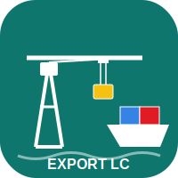
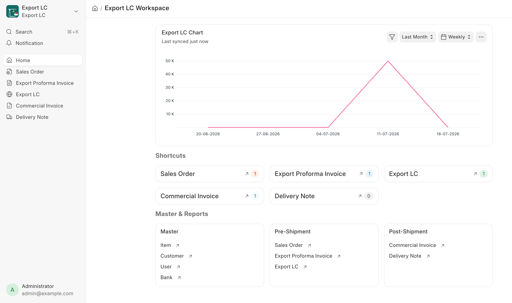
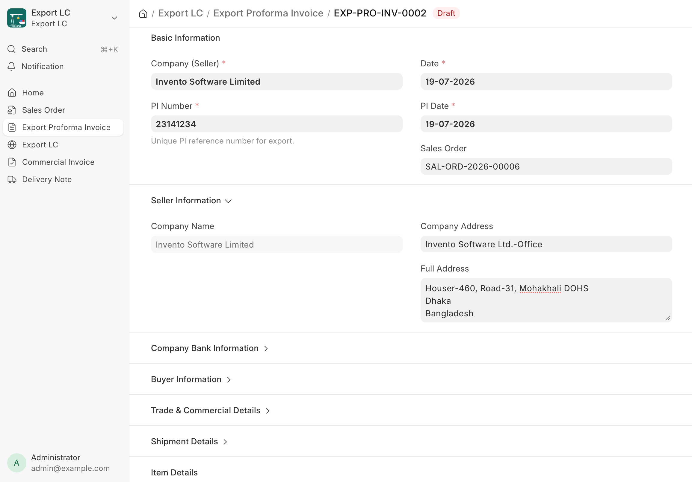
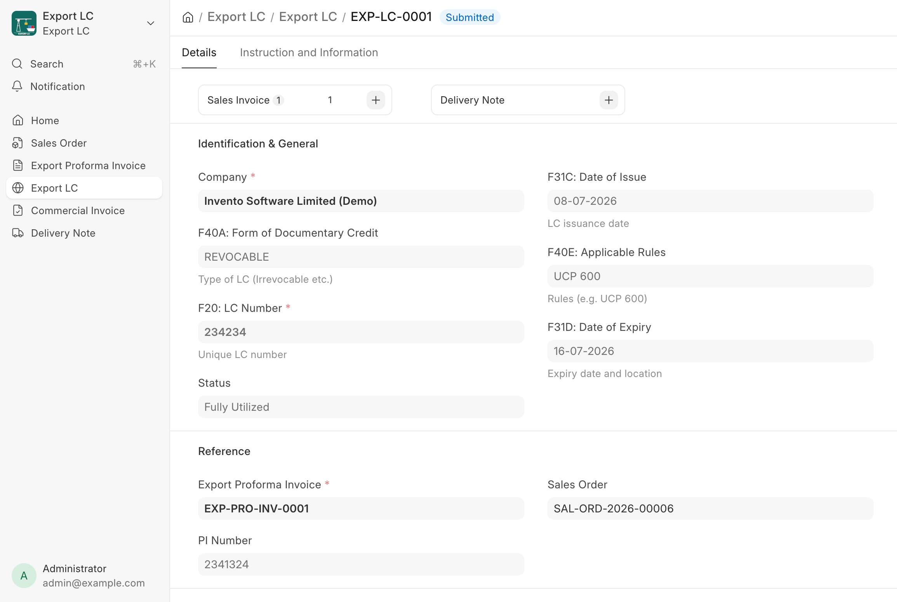

   <div align="center" markdown="1">


<h1>Export LC</h1>

**Export LC (Letter of Credit) Management, Made Simple and Effective**

[](https://github.com/invento-software-limited/export-lc/actions/workflows/ci.yml)
[](https://github.com/invento-software-limited/export-lc/actions/workflows/linter.yml)

</div>

<div align="center">
	
</div>
<br />
<div align="center">
	<a href="https://invento-software-limited.github.io/export-lc/">Documentation</a>
</div>

## Export LC
An Export Letter of Credit (LC) tracking and management application for Frappe and ERPNext (version-16), developed by **Invento Software Limited**. It simplifies tracking export contracts, banking requirements, and Letters of Credit to ensure financial compliance and streamline documentation.

### Motivation
Managing export billing, commercial documentation, and tracking bank letters of credit was complex and manual. We wanted a seamless extension for ERPNext to connect Sales Orders directly to Export Proforma Invoices, trace active/expired/utilized bank LCs, and automatically map these to Commercial Invoices and Delivery Notes. This app makes managing export LCs automated and transparent.

### Key Features

- **Sales Order Integration**: Easily generate Proforma Invoices directly from approved ERPNext Sales Orders with automatic mapping of values and items.
- **SWIFT MT700 Field Matching**: Track LC issuing bank, advising bank, tolerance, expiry dates, documents required, and instruction codes.
- **Dynamic Utilization Tracking**: System dynamically monitors LC utilization statuses (Draft, Active, Partially Utilized, Fully Utilized, Expired, Cancelled) against linked sales invoices.
- **Automatic In-Words Conversion**: Documents display total value converted to words in both foreign contract currency and local company currency.
- **Integrated Workspace & Dashboards**: View totals, utilization ratios, and LC distribution charts directly from the Desk.

<details open>
<summary>View Screenshots</summary>
<br>


#### Export Proforma Invoice



#### Export LC



</details>
<br>

### Under the Hood

- [**Frappe Framework**](https://github.com/frappe/frappe): A full-stack web application framework written in Python and Javascript.
- [**ERPNext**](https://github.com/frappe/erpnext): The core open-source ERP system version-16.

## Production Setup

For self-hosting and deploying on production environments using Docker, refer to our detailed deployment guide:
- [Docker Deployment Guide](docs/docker-deployment.md)

## Development Setup

To setup the repository locally in your bench:

1. Install bench and setup your `frappe-bench` directory by following the [Installation Steps](https://frappeframework.com/docs/user/en/installation).
2. Start the server by running `bench start`.
3. In a separate terminal window, create a new site by running `bench new-site export-lc.test`.
4. Map your site to localhost with the command:
   ```bash
   bench --site export-lc.test add-to-hosts
   ```
5. Get the ERPNext app:
   ```bash
   bench get-app erpnext --branch version-16
   ```
6. Get the Export LC app:
   ```bash
   bench get-app https://github.com/invento-software-limited/export-lc.git --branch version-16
   ```
7. Install the app on your site:
   ```bash
   bench --site export-lc.test install-app export_lc
   ```
8. Run database migrations:
   ```bash
   bench --site export-lc.test migrate
   ```
9. Build assets:
   ```bash
   bench build --app export_lc
   ```
10. Now open the URL `http://export-lc.test:8000/app/export-lc-workspace` in your browser.


## Compatibility matrix

| Export LC Branch | Compatible Frappe/ERPNext Version |
| ---------------- | --------------------------------- |
| version-16       | version-16                        |
| develop          | develop branch                    |

## Contributing

This application uses `pre-commit` for code formatting, quality checks, and linter validation.

### Setup Pre-commit locally:
1. Install pre-commit on your system.
2. Enable pre-commit in this repository:
   ```bash
   cd apps/export_lc
   pre-commit install
   ```

### Configured Tools:
- **Ruff**: For Python linting and formatting.
- **ESLint**: For Javascript code formatting.
- **Prettier**: For formatting JSON, YAML, and CSS files.
- **Semgrep**: For security analysis checks.

## License

MIT License. See the [license.txt](license.txt) file for details.