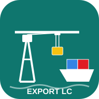
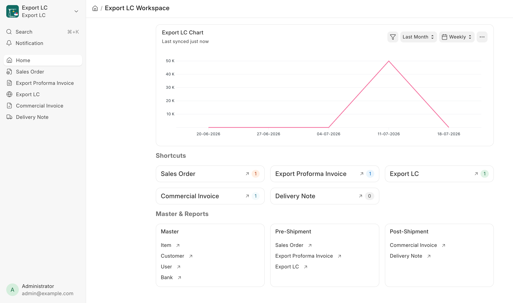
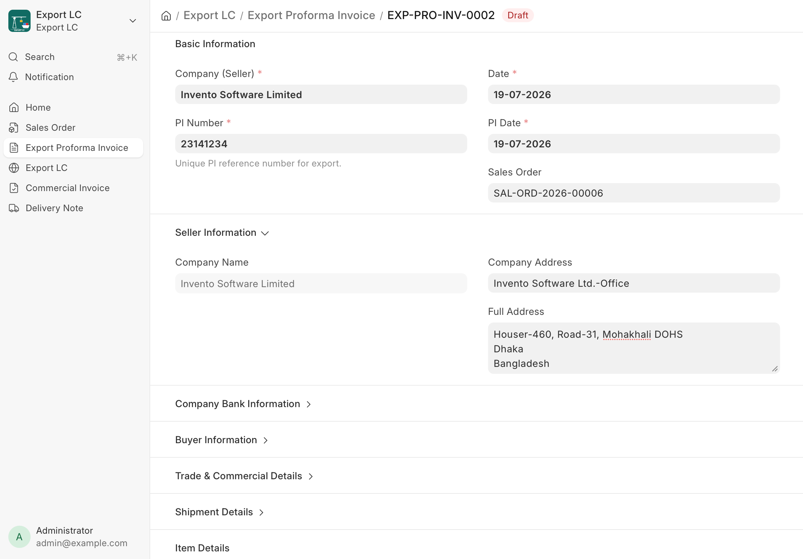
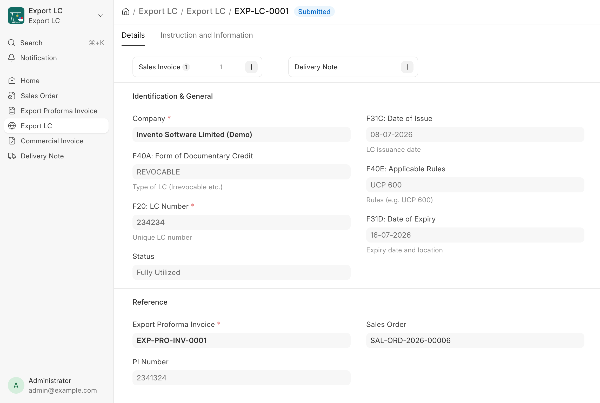

<div align="center">



# Export LC for ERPNext

**Export letter of credit management for ERPNext v16—from sales order to commercial invoice and delivery.**

[](https://github.com/invento-software-limited/export-lc/actions/workflows/ci.yml)
[](https://github.com/invento-software-limited/export-lc/actions/workflows/linter.yml)
[](https://github.com/frappe/erpnext)
[](license.txt)

<a href="https://cloud.frappe.io/marketplace/apps/export_lc"></a>
<a href="https://invento-software-limited.github.io/export-lc/"></a>

<a href="https://invento.com.bd/import-export-lc-management-erpnext/">Read the LC management guide</a> · <a href="https://github.com/invento-software-limited/import-lc">Explore Import LC</a>

</div>



## See each export credit beside the order, invoice and delivery it governs

ERPNext manages sales orders, invoices, deliveries and accounting. Export LC adds the documentary-credit record between those steps, helping export teams keep commercial terms, bank fields and utilization in the same workflow rather than rebuilding the position in spreadsheets and files.

> **Scope:** Export LC records and maps LC data inside ERPNext. It does not connect to a bank, transmit SWIFT messages or replace bank approval and document-checking procedures.

## Export LC workflow at a glance

```text
Sales Order
     │
     ▼
Export Proforma Invoice
     │
     ▼
Export LC
     ├────────► Sales Invoice (Commercial Invoice)
     └────────► Delivery Note
                      │
                      ▼
       Utilization and LC status recalculated
```

## What teams can do

| Task | How Export LC helps |
| --- | --- |
| Start from approved sales data | Create an **Export Proforma Invoice** from a Sales Order and carry forward items, currency and commercial details. |
| Maintain the documentary credit | Record the Export LC with applicant, beneficiary, issuing and beneficiary bank, value, dates, tolerance and shipment/document terms. |
| Create commercial documents | Create a Sales Invoice (commercial invoice) or Delivery Note from the Export LC without re-entering the transaction. |
| Monitor drawdown | Calculate utilization from submitted Sales Invoices linked to the Export LC. |
| Read lifecycle status | Use Draft, Active, Partially Utilized, Fully Utilized, Expired and Cancelled states to identify the next action. |
| Review activity visually | Use the Export LC workspace, shortcuts and status chart for a faster operational view. |

The form also contains a selectable `Closed` status for manual use; the automatic status calculation does not assign it.

## Familiar MT700-aligned fields

The Export LC form includes commonly used documentary-credit fields such as reference number (F20), issue and expiry dates (F31C/F31D), credit form (F40A/F40E), applicant and beneficiary (F50/F59), tolerance (F39A), partial shipment and transshipment (F43P/F43T), latest shipment date (F44C), goods and documents (F45A/F46A), additional conditions (F47A), charges (F71D) and instructions (F78).

These fields help structure LC information; they do not claim automatic SWIFT MT700 generation or transmission.

## Product screenshots

| Export Proforma Invoice | Export LC record |
| --- | --- |
|  |  |

## Export or import—which app do you need?

<table width="100%">
  <thead>
    <tr>
      <th width="70%" align="left">Use case</th>
      <th width="30%" align="left">Choose this app</th>
    </tr>
  </thead>
  <tbody>
    <tr>
      <td>A buyer opens an LC in your favour and you ship against it</td>
      <td><strong>Export LC</strong><br><sub>THIS REPOSITORY</sub></td>
    </tr>
    <tr>
      <td>You open an LC to buy goods, materials or machinery from a supplier</td>
      <td><a href="https://github.com/invento-software-limited/import-lc"><strong>Explore Import LC →</strong></a></td>
    </tr>
  </tbody>
</table>

Businesses—including ready-made garment exporters using back-to-back LCs—can install both apps to manage each direction. In the current `version-16` repositories, the apps manage their respective workflows; they do not automatically create a master export LC/back-to-back import LC relationship across apps.

<div align="center">

<h3>Understand the complete import and export LC workflow</h3>

<a href="https://invento.com.bd/import-export-lc-management-erpnext/"></a>

</div>

## Installation

### Frappe Cloud

<a href="https://cloud.frappe.io/marketplace/apps/export_lc"></a>

Recommended for managed Frappe Cloud installations.

### Self-hosted bench

Use an existing Frappe/ERPNext v16 bench:

```bash
bench get-app https://github.com/invento-software-limited/export-lc.git --branch version-16
bench --site your-site.example install-app export_lc
bench --site your-site.example migrate
bench build --app export_lc
```

Open the app from the ERPNext app switcher after installation. For a fresh bench or site, follow the [official Frappe installation guide](https://frappeframework.com/docs/user/en/installation) first.

## Requirements and compatibility

<table width="100%">
  <thead>
    <tr>
      <th width="25%" align="left">Frappe Framework</th>
      <th width="25%" align="left">ERPNext</th>
      <th width="25%" align="left">Python</th>
      <th width="25%" align="left">App branch</th>
    </tr>
  </thead>
  <tbody>
    <tr>
      <td><code>&gt;=16.0.0-dev, &lt;17.0.0-dev</code></td>
      <td>v16</td>
      <td>3.10 or newer</td>
      <td><code>version-16</code></td>
    </tr>
  </tbody>
</table>

The repository also has a `develop` branch for active development; production v16 installations should use `version-16`.

## Documentation and support

- [User guide](docs/user_guide.md)
- [Product overview](docs/product_overview.md)
- [Published documentation](https://invento-software-limited.github.io/export-lc/)
- [Report a reproducible issue](https://github.com/invento-software-limited/export-lc/issues)

When reporting a problem, include your Frappe and ERPNext versions, the affected document type, steps to reproduce and a redacted screenshot where useful. Never include LC numbers, bank credentials or confidential trade documents in a public issue.

## Contributing

Contributions are welcome. Install the repository's pre-commit hooks before opening a pull request:

```bash
cd apps/export_lc
pre-commit install
pre-commit run --all-files
```

The project uses Ruff, ESLint, Prettier and Semgrep alongside its CI checks.

## Publisher

Built and maintained by [Invento Software Limited](https://invento.com.bd/), an ERPNext partner in Bangladesh.

## License

MIT. See [license.txt](license.txt).
