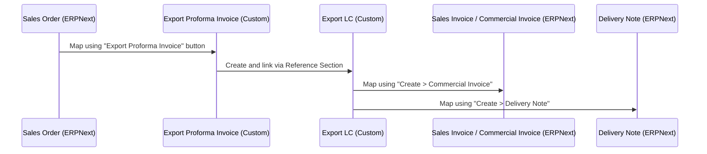

# User Guide

This guide describes how to use the **Export LC** module in your ERPNext site to track export contracts and manage bank Letters of Credit (LC).

---

## 1. Export Workflow Lifecycle

---

## 2. Step-by-Step Instructions

### Step 1: Create a Sales Order
1. Navigate to **Selling > Sales Order > New**.
2. Set the `sales_type` field to **Export**.
3. Fill in your items, customer details, and shipping terms.
4. Save and **Submit** the Sales Order.

### Step 2: Generate an Export Proforma Invoice (PI)
Once a Sales Order is submitted:
1. Open the submitted **Sales Order** form.
2. In the top-right toolbar, click **Create** and select **Export Proforma Invoice**.
3. The system maps customer, currency, items, and logistics data automatically.
4. Fill in the **Company Bank Information** (select your bank). The system pulls:
   - Account Number / IBAN
   - SWIFT Code
   - Bank Address
5. Save and **Submit** the Proforma Invoice.

### Step 3: Record the Export LC
When the buyer's advising bank issues the LC:
1. Go to **Export LC > Export LC > New**.
2. Under **Reference Section**, select the linked **Proforma Invoice**. The system fetches the linked `Sales Order`, items, and currencies.
3. Enter the official **LC No** and select the **Form of Documentary Credit** (e.g., Irrevocable).
4. Define the logistics:
   - Date of Issue
   - Date and Place of Expiry
   - Latest Date of Shipment
   - Ports of Loading and Discharge
5. Paste bank-required documents into **Documents Required** (e.g. Bill of Lading, Packing List).
6. Save and **Submit** the Export LC.

### Step 4: Issue the Commercial Invoice (Sales Invoice)
To bill shipments against the LC:
1. Open the submitted **Export LC** document.
2. Click **Create** and select **Sales Invoice** (this acts as the **Commercial Invoice**).
3. The system maps the LC details and defaults the naming series to `COM-INV-.YYYY.-`.
4. Submit the Sales Invoice.
5. The linked **Export LC** status will automatically update to **Partially Utilized** or **Fully Utilized** depending on the billed amount.

### Step 5: Generate the Delivery Note
To record physical shipment against the LC:
1. Open the submitted **Export LC** document.
2. Click **Create** and select **Delivery Note**.
3. Complete the shipment details and **Submit** the document.
